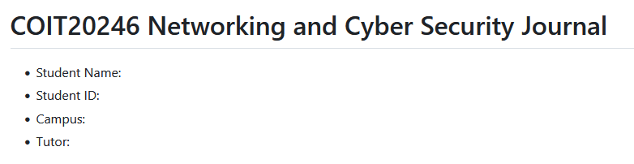

# Week 1 | Unit Introduction

## Task 5. Summary of My Knowledge

I have previously studied a Bachelor of ... . I already know the following about networking and cyber security:
- Setting ip a Cisco router with IOS on command line
- ...

The following is a screenshot of the details:

## Task 5. Knowledge Test Score

The following is a screenshot of my Knowledge Test score:

